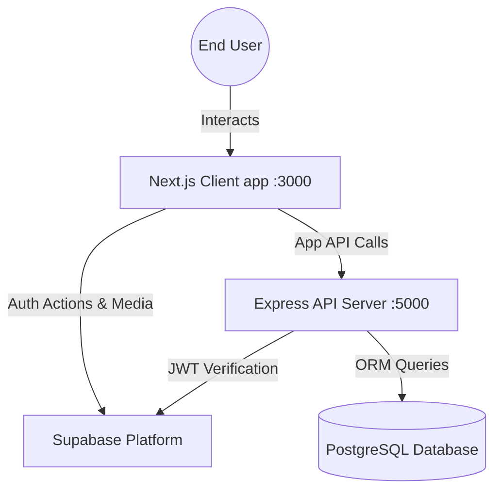
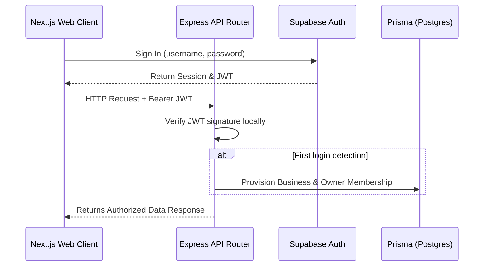
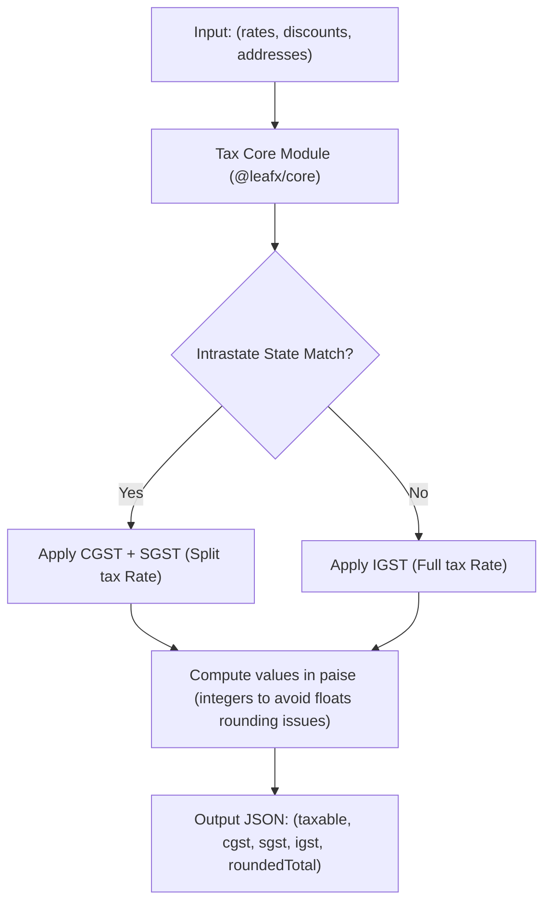

# 🍃 Leafx

[](https://turbo.build/)
[](https://nextjs.org/)
[](https://expressjs.com/)
[](https://prisma.io/)
[](https://supabase.com/)

> A high-fidelity GST Billing, Accounting & Inventory platform for Indian SMEs, modeled after the best-in-class features of Vyapar. Built for fast counter POS billing, inventory management, interstate/intrastate tax calculations, ledger tracking, and multi-tenant isolation.

---

## 📖 Table of Contents

- [Ecosystem & Features](#-ecosystem--features)
- [Monorepo Architecture](#-monorepo-architecture)
- [Tech Stack](#-tech-stack)
- [Environment Configuration](#-environment-configuration)
- [Getting Started](#-getting-started)
- [Developer Commands](#-developer-commands)
- [Architecture Diagrams](#%EF%B8%8F-architecture-diagrams)
- [Database Schema & Migrations](#-database-schema--migrations)

---

## 🌟 Ecosystem & Features

Leafx is partitioned into core business capabilities engineered to solve day-to-day operations for small and medium enterprises:

*   **Sales Billing & POS:** Intrastate (CGST + SGST) and Interstate (IGST) automatic calculations, flat/percentage invoice discounts, custom series numbering, POS counter billing, thermal print layout, and Tally-style A4 PDF invoices.
*   **Inventory & Items:** Dynamic Product/Service definitions, measurement unit mapping, dynamic pricing rules (tax-inclusive/exclusive sale, purchase, and wholesale tiers), low-stock thresholds, batch expiry trackers, and serial number registries.
*   **Parties Ledger:** Comprehensive Customer/Supplier directory, credit limit and period guards, opening balance tracking, dynamic GSTIN verification, detailed address mapping, and live running account statement reports.
*   **Business Settings & Multi-tenancy:** Isolated workspaces per registered business profile, signature/logo asset storage, custom invoice terms, and role-based staff matrices.

---

## 📂 Monorepo Architecture

Leafx uses **Turborepo** to orchestrate dependencies and builds across frontend, backend, and shared libraries:

```text
├── client/
│   └── web/                 # Next.js web application (Dashboard, POS, Invoices)
├── server/
│   └── api/                 # Express API server (Controllers, auth verification, PDF rendering)
├── shared/
│   ├── core/                # Shared utilities & GST tax computation engine
│   ├── db/                  # Shared Prisma schema, clients, and db migrations
│   └── types/               # Common TypeScript interfaces & Zod validation schemas
├── package.json             # Root monorepo workspace dependencies & orchestrator
└── turbo.json               # Turborepo task pipeline configuration
```

---

## 🛠️ Tech Stack

### Frontend App (`client/web`)
*   **Framework:** React 19, Next.js 15 (App Router)
*   **State & Querying:** TanStack Query (React Query)
*   **Forms:** React Hook Form + Zod resolvers
*   **Styling:** Tailwind CSS + Radix UI Primitives (shadcn/ui template components)

### Backend API (`server/api`)
*   **Runtime:** Node.js, Express, TypeScript (`tsx` execution)
*   **Auth Proxy:** Supabase Auth JWT validation middleware
*   **Database Interface:** Prisma Client

### Database & Storage
*   **Database:** Postgres (hosted on Supabase)
*   **Authentication:** Supabase Auth (username-password, OTP, email-confirmed users)
*   **Assets Storage:** Supabase Storage (logo, signatures, product images)

---

## ⚙️ Environment Configuration

### Root Environment (`/.env`)
Create a `.env` file at the monorepo root:

```ini
# --- Ports ---
API_PORT="5000"
NEXT_PUBLIC_API_URL="http://localhost:5000"

# --- Prisma / Postgres (Supabase) ---
DATABASE_URL="postgresql://postgres.<project-ref>:<password>@<pooler-host>:6543/postgres?pgbouncer=true"
DIRECT_URL="postgresql://postgres.<project-ref>:<password>@<direct-host>:5432/postgres"

# --- Supabase Project Credentials ---
SUPABASE_URL="https://<project-ref>.supabase.co"
SUPABASE_ANON_KEY="eyJhbGciOiJIUzI1NiIsInR..."
SUPABASE_SERVICE_ROLE_KEY="eyJhbGciOiJIUzI1NiIsInR..."
SUPABASE_JWT_SECRET="JWT_HMAC_Secret..."
NEXT_PUBLIC_SUPABASE_URL="https://<project-ref>.supabase.co"
NEXT_PUBLIC_SUPABASE_ANON_KEY="eyJhbGciOiJIUzI1NiIsInR..."
```

### Client Environment (`/client/web/.env`)
Next.js loads public environment variables from the application directory:

```ini
NEXT_PUBLIC_API_URL="http://localhost:5000"
NEXT_PUBLIC_SUPABASE_URL="https://<project-ref>.supabase.co"
NEXT_PUBLIC_SUPABASE_ANON_KEY="eyJhbGciOiJIUzI1NiIsInR..."
```

---

## 🚀 Getting Started

### 1. Install Dependencies
Installs workspace packages and sets up local symlinks in one step:
```bash
npm install
```

### 2. Generate Prisma Client
Generates the Prisma Client binary inside `shared/db` using the schema:
```bash
npm run db:generate
```

### 3. Run Development Servers
Starts the Express API on port `5000` and the Next.js frontend on port `3000` using Turborepo pipeline:
```bash
npm run dev
```

Open **[http://localhost:3000](http://localhost:3000)** in your browser.

---

## 💻 Developer Commands

The following scripts can be run from the monorepo root:

| Command | Workspace Scope | Description |
| :--- | :--- | :--- |
| `npm run dev` | Monorepo Root | Launches web application and backend API concurrently |
| `npm run dev:client` | `client/web` | Runs ONLY the Next.js frontend app |
| `npm run dev:server` | `server/api` | Runs ONLY the Express API backend |
| `npm run build` | Monorepo Root | Compiles and builds all workspaces for production |
| `npm run typecheck` | Monorepo Root | Performs type checking across all workspaces |
| `npm run db:push` | `shared/db` | Pushes the local schema modifications to the active DB |
| `npm run db:studio` | `shared/db` | Launches Prisma Studio GUI interface on port `5555` |
| `npm test` | `shared/core` | Runs test runner for the custom GST tax calculation engine |

---

## 🗺️ Architecture Diagrams

Here are core architectural flows representing the operations of the application:

### 1. System Overview Architecture



### 2. Authentication & Provisioning Flow



### 3. Sales Tax Calculation Engine



---

## 🗄️ Database Schema & Migrations

Database operations are modeled in [schema.prisma](file:///h:/UniCord/Product/Vyapar/server/prisma/schema.prisma) under `server/prisma`.

To perform schema modifications:
1. Make changes to the `schema.prisma` file.
2. Run `npm run db:push` to apply changes directly to the developer database.
3. Run `npm run db:generate` to regenerate database type interfaces.
# invoxia

